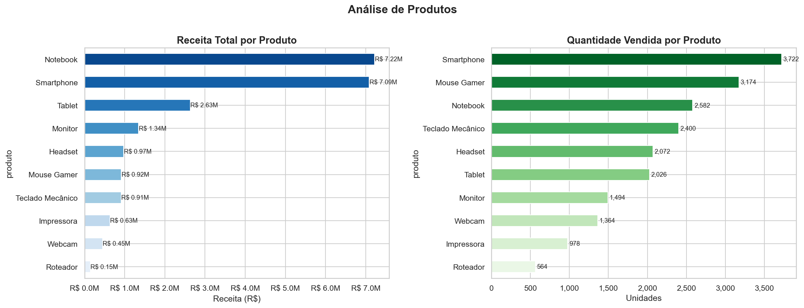
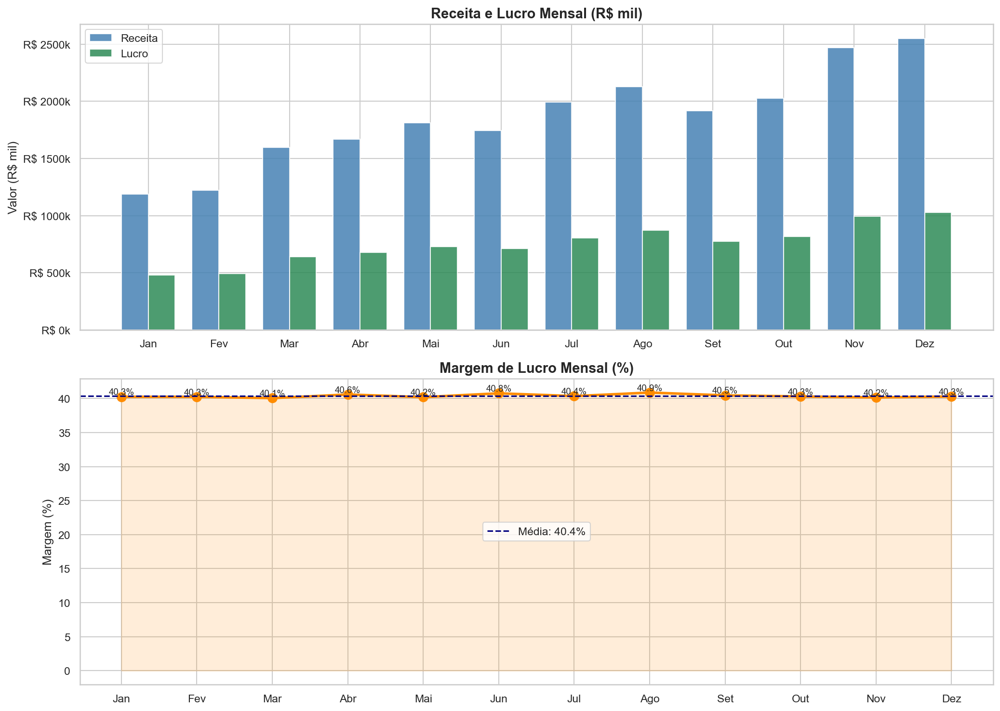
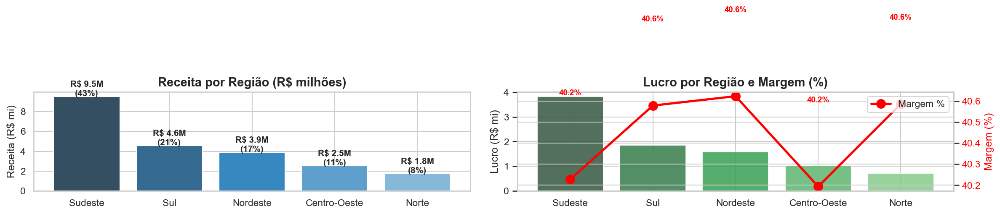
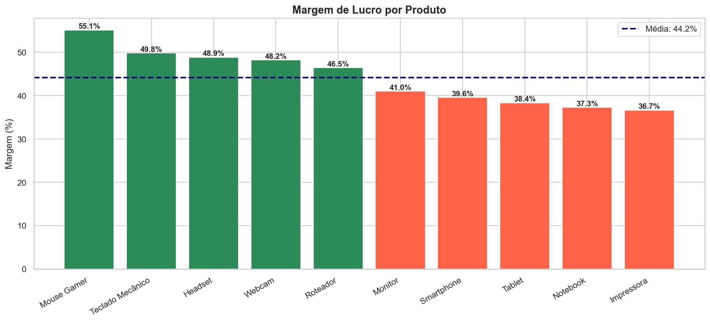

# Análise de Vendas — Loja de Eletrônicos (Brasil 2024)


> Análise exploratória de dados de vendas de eletrônicos no Brasil (2024) com Python, Pandas e Seaborn. Projeto de portfólio com foco em **tomada de decisão baseada em dados**.

---

## Resultados em Números

| Métrica | Valor |
|---------|-------|
| Receita Total | R$ 22.318.832 |
| Lucro Total | R$ 9.015.432 |
| Margem Média | 40,4% |
| Produto Líder | Smartphone (receita) |
| Maior Margem | Mouse Gamer (47%) |
| Melhor Trimestre | Q4 — 33% do faturamento |
| Região Líder | Sudeste — 42% das vendas |
| Total de Transações | 5.000 |

---

## Problema de Negócio

Uma loja de eletrônicos com atuação nacional precisa tomar decisões baseadas em dados para o planejamento de 2025:

- Onde concentrar o estoque?
- Em quais meses aumentar a verba de marketing?
- Quais produtos maximizam o lucro?
- Quais regiões merecem maior investimento?

---

## Dataset

Dataset sintético de **5.000 transações** simulando padrões reais do varejo brasileiro de eletrônicos em 2024.

| Campo | Descrição |
|-------|-----------|
| `data` | Data da venda |
| `produto` | Nome do produto (10 SKUs) |
| `categoria` | Computadores, Celulares, Periféricos, Redes |
| `regiao` | Norte, Nordeste, Centro-Oeste, Sudeste, Sul |
| `quantidade` | Unidades vendidas |
| `preco_unitario` | Preço de venda (R$) |
| `custo_unitario` | Custo do produto (R$) |
| `receita` | quantidade × preço |
| `lucro` | quantidade × (preço − custo) |

---

## Visualizações

### Receita e Volume por Produto


### Sazonalidade Mensal


### Performance por Região


### Margem de Lucro por Produto


---

## Perguntas Respondidas

1. **Quais produtos vendem mais?** (receita e volume)
2. **Qual mês fatura mais?** Existe sazonalidade?
3. **Qual região performa melhor?**
4. **Quais produtos têm maior margem de lucro?**

---

## Principais Insights

| # | Insight | Impacto |
|---|---------|---------|
| 1 | **Smartphone é o campeão de receita** — maior volume com ticket médio-alto | Alto |
| 2 | **Q4 concentra ~33% do faturamento anual** — sazonalidade forte em Nov/Dez | Alto |
| 3 | **Sudeste representa 42% das vendas**, mas Norte e Nordeste têm margem similar | Médio |
| 4 | **Mouse Gamer e Teclado Mecânico têm as maiores margens** — produtos estratégicos | Alto |
| 5 | **Notebook lidera em receita absoluta**, mas margem está abaixo da média | Médio |

### Recomendações

- **Criar bundles de periféricos** (Mouse + Teclado + Headset): margens mais altas e ticket maior
- **Dobrar estoque em outubro** para capturar toda a demanda de Black Friday
- **Investir em distribuição no Norte e Nordeste**: crescimento com boa margem, base ainda pequena
- **Negociar condições com fornecedores de notebook**: produto de maior receita com margem abaixo da média

---

## Estrutura do Projeto

```
analise-vendas-python/
├── data/
│   ├── vendas.csv              # Dataset gerado pelo notebook
│   ├── grafico_produtos.png
│   ├── grafico_mensal.png
│   ├── grafico_regioes.png
│   ├── grafico_margem.png
│   └── grafico_heatmap.png
├── notebook.ipynb              # Análise completa
├── requirements.txt
└── README.md
```

---

## Como Executar

```bash
# 1. Clone o repositório
git clone https://github.com/floresjacques26/analise-vendas-python.git
cd analise-vendas-python

# 2. Instale as dependências
pip install -r requirements.txt

# 3. Abra o notebook
jupyter notebook notebook.ipynb
```

> Execute as células em ordem. A primeira célula gera o arquivo `data/vendas.csv` automaticamente.

---

## Stack

`Python 3.13` · `Pandas` · `NumPy` · `Matplotlib` · `Seaborn` · `Jupyter Notebook` · `Streamlit`
